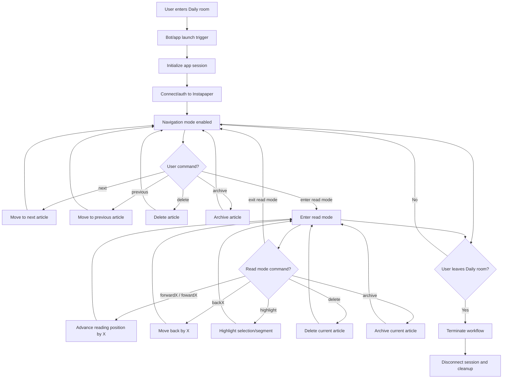

# User Journey

## Mermaid Source

## Text-Based Workflow

1. User enters the Daily room.
2. Launch trigger fires and starts the bot/app session.
3. App initializes and connects/authenticates to Instapaper.
4. Navigation mode is enabled.
5. In navigation mode, user can issue commands: `next`, `previous`, `delete`, `archive`, or enter read mode.
6. `next`, `previous`, `delete`, and `archive` keep the user in navigation mode.
7. Entering read mode switches into read mode command loop.
8. In read mode, user can issue commands: `forwardX` (or `fowardX`), `backX`, `highlight`, `delete`, `archive`, or `exit read mode`.
9. `forwardX`, `backX`, `highlight`, `delete`, and `archive` keep the user in read mode.
10. `exit read mode` returns to navigation mode.
11. If the user leaves the Daily room from either mode, the workflow terminates.
12. App disconnects and performs cleanup.
