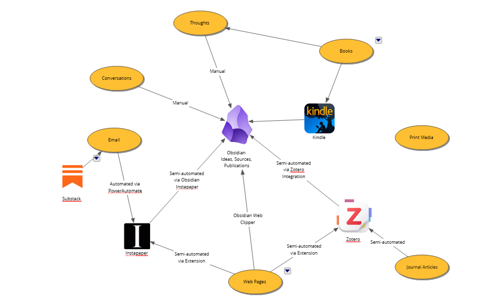
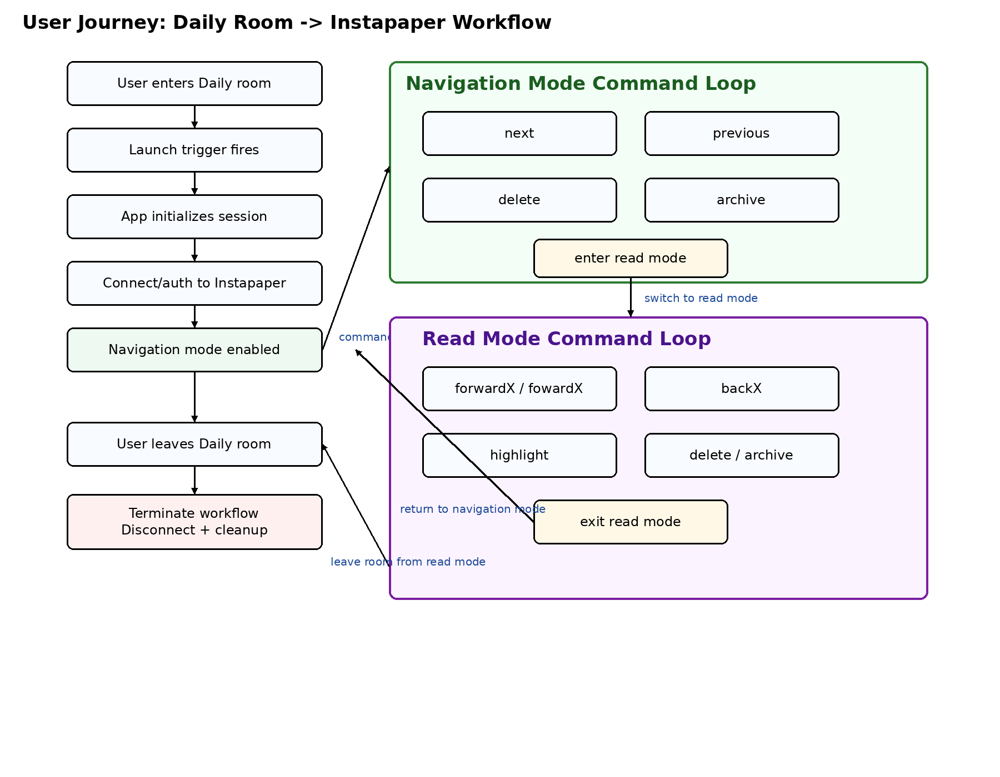

Instapaper is a read‑later service that lets you save web content—such as articles, videos, and recipes—with a single click so you can return to it anytime. It provides a clean, focused reading environment across devices, emphasizing the ability to “read anywhere” once content is saved. The service also allows you to create notes by highlighting and commenting on text within saved articles, making it easier to capture and organize important ideas or quotes. These annotations can then be stored, searched, retrieved, and reused for later reference or sharing. Instapaper’s core value proposition is simplifying how you capture, manage, and revisit the best content you encounter online, turning scattered browsing into a personalized reading and research archive.

My designer, adaptiman, has used Instapaper for years. As you can see in the graphic, Instapaper has become an important node in the information workflow for him.  But as good as it is for collecting content, it didn't provide the level of idea-linking he needed. Adaptiman uses Obsidian for creating a source of linked ideas. Obsidian had become his "mothership" of ideas, his sole source of truth. But how could he get the vast content he was collecting via Instapaper into Obsidian?

It turns out that the best way is to use the plugin made by Instapaper. This plugin creates notes from annotated Instapaper articles in Obsidian automatically. This was the critical link adaptiman needed to turbo-charge his information workflow.

But there was a second problem. The amount of content adaptiman was collecting through Instapaper was huge, and revisiting the web or mobile app was taking too much time. What he really wanted was a way to process Instapaper content on his way to work in the car, or sitting on the back porch, not tethered to his computer.

Next, I'll show you what I can do by demonstrating my features.

